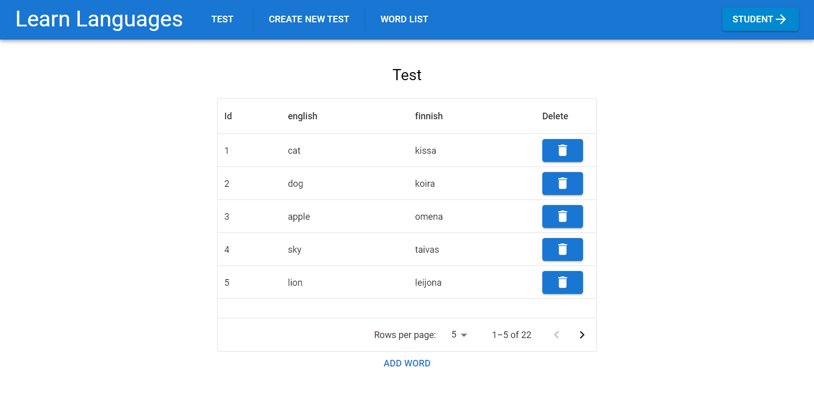

# Learn Languages

<!-- </img> -->

## Table of Contents

-   [Description](#Description)
-   [Features](#Features)
-   [Copyright](#Copyright)
-   [Author](#Author)

## Description

This is a school project that was developed for a school backend course.

This is my first fullstack project.

## Features

-   Supported languages at the moment are English, Finnish, Swedish, German and Italian.

In teacher view you can:

-   Update, add and delete words from the server.
-   Alter the current active exam by deleting words or adding words to it from the server.
-   Create a completely new exam, by selecting languages and words for the exam.

In student view you can:

-   Fill in the test made by the teacher.
-   Get your score for the exam.

## Usage

To use Learn Languages, simply navigate to the website here: [Learn Languages](https://learn-languages-49sl.onrender.com/).

Screencast: [Youtube](https://www.youtube.com/watch?v=z84n52_qFyU).

Teacher side:

First you are greeted by the current test. This is what the student side sees. On the left is the question language and on the right is the answers. To add a word to the current exam you can click on the "Add word" below. To delete a word click on the trash can on the corresponding row.

</img>

You can access the word list on the top navigation bar. To make changes to the word list simply click on the word you want to update. Be careful, these changes are saved to the server!

</img>

If you want to delete a whole word, click on the trashcan on the last column. If you want to add a completely new word, simply click on the "Add word" below the word list.

</img>

On the "Create new test" you can make a completely new test. Choose languages from the dropdowns and click use. The site will show you all the possible words for those languages. Delete words that you don't want in the exam. When you press "Save as current test", the test you generated will be set as the current exam and will be visible to you in the "Test" site and also to the student.

</img>

Student side:

Simply fill in the form as best as you can. After clicking "Submit" you will see your score. After seeing your score you have two options: "Continue" and "Start Over". If you select "Continue", all your right answers stay in place, but wrong ones revert to empty. Like this you know where you messed up and can try again! If you select "Start over" all the answers empty. This also happens if you press "Empty" at any point while doing the exam.

</img>

## Copyright

Copyright (c) 2024 Jenny Myllymaa

## Author

Jenny Myllymaa <jenny.i.myllymaa@tuni.fi>  
